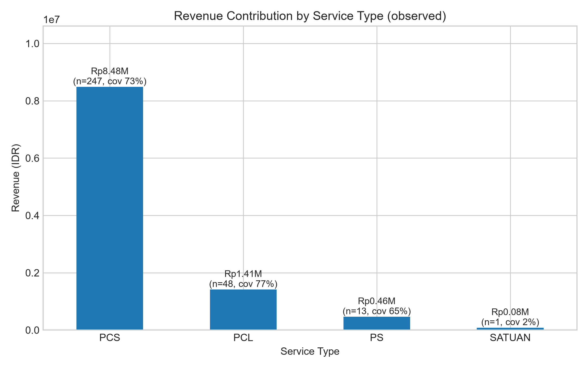
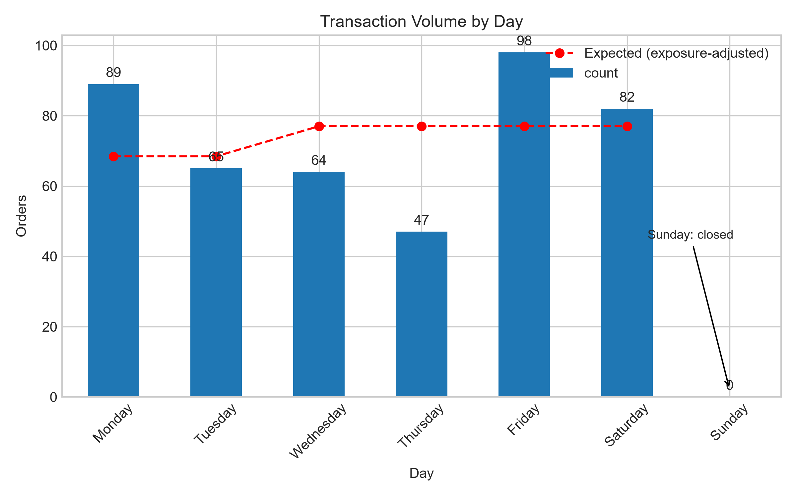
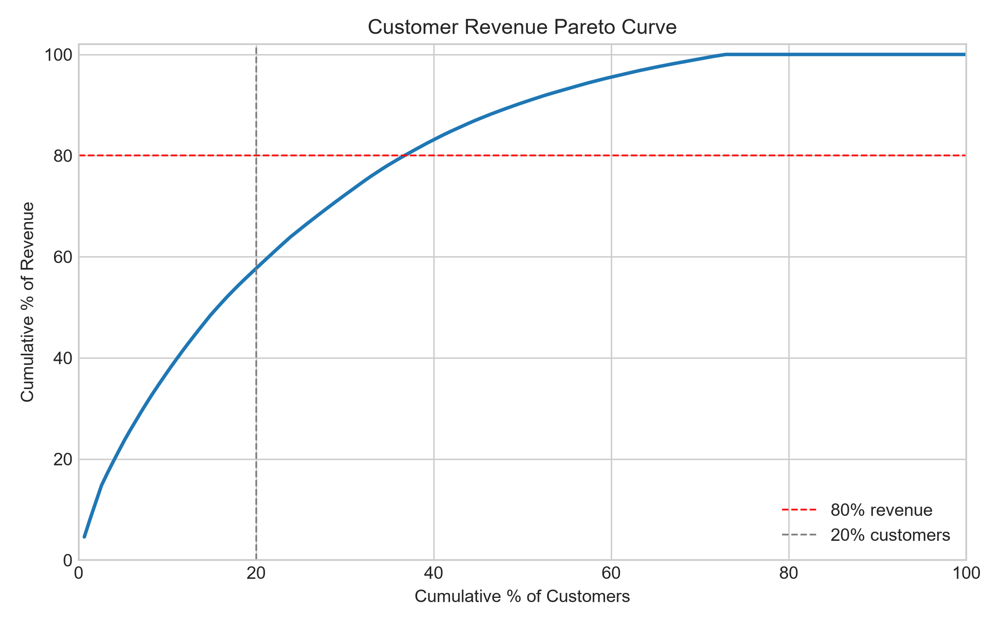
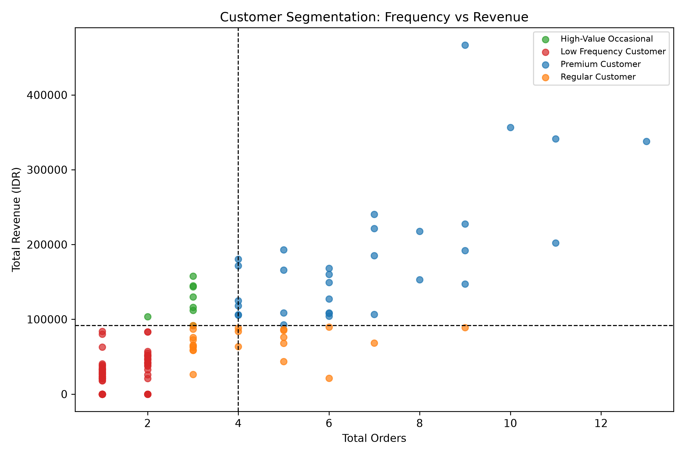
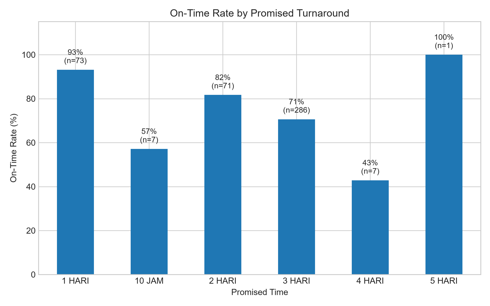

# Laundry Kampus Analytics

> Analyzing customer value and operational reliability through transaction data.

**Scope:** Laundry Kampus study case (anonymized) · **Period:** 1 April – 30 May 2026 · **Records:** 467 validated transactions · 155 identified customers
**Stack:** Python · pandas · NumPy · Matplotlib · Streamlit · permutation and bootstrap statistics
**Live:** [laundry-operations-analytics.streamlit.app](https://laundry-operations-analytics.streamlit.app/)

---

## Project Overview

This project looks at two months of laundry transaction records to answer three questions: who the valuable customers are, how revenue is distributed across customers and services, and whether delivery promises are actually kept.

The pipeline runs from data cleaning through exploratory analysis, customer segmentation, and statistical testing. Every number in this README can be reproduced by running the scripts in `notebooks/`.

One caveat shapes everything else: revenue is only recorded on 66.2% of transactions. The analysis puts a number on that gap and labels every revenue figure as observed revenue instead of quietly assuming the data is complete.

---

## Business Problem

A laundry business handles many transactions every day, but the records usually stay in raw spreadsheet form. The analysis answers:

1. Which customers contribute the most business value?
2. How is revenue distributed across customers and services — and how reliable is the observed revenue itself?
3. Are turnaround promises consistently achieved, and where does lateness concentrate?
4. Which business assumptions survive statistical testing, and which do not?

Central question:

> How can transaction data be used to understand customer value and support operational decisions in a laundry business?

---

## Dataset

| Item | Value |
|---|---|
| Source | Field records of a campus laundry, anonymized (`data/raw/laundry_raw.csv`) |
| Period | 2026-04-01 – 2026-05-30 (two full months) |
| Raw export | 472 rows, including non-transaction records and one duplicate entry |
| After validation | **467 validated transactions** |
| Identifiable | 447 transactions carry a customer name (20 do not) |
| Customers | 155 unique customers (name-standardized to `Customer_001` … `Customer_155`) |
| Weight | 1,846.3 kg recorded (91.9% coverage on weight-based orders) |

> 472 exported rows → 467 validated transactions → 447 identifiable transactions → 155 customers.

> Note: 22 transactions have no usable `order_date`, so month/weekday analyses use the 445 dated transactions.

### Data Dictionary (key columns)

| Column | Description |
|---|---|
| `order_date`, `completion_date` | Order intake and completion dates |
| `service_type` | PCS (337), PCL (62), SATUAN (48), PS (20) |
| `service_detail` | Promised turnaround: `10 JAM`, `1 HARI`, `2 HARI`, `3 HARI`, `4 HARI`, `5 HARI` |
| `service_category` | `LAUNDRY PACKAGE` (419) or `PER ITEM` (48, all SATUAN) |
| `weight_kg` | Order weight (weight-based services only) |
| `total_revenue` | Observed revenue per transaction (66.2% coverage) |
| `unit_cost`, `express_cost` | Cost fields — essentially not captured (0.6% / 4.9% coverage) |
| `voucher_amount`, `voucher_code` | Voucher usage (21 of 467 orders used a voucher) |
| `customer_id` | Standardized customer identifier |
| `promised_days`, `service_days` | Promised turnaround vs actual turnaround in calendar days |
| `service_open_days` | Actual turnaround in open days (Monday–Saturday) — the basis for all SLA figures |
| `is_late`, `days_late` | SLA compliance flag and lateness, both in open days |
| `revenue_per_kg` | Observed revenue ÷ weight |
| `has_customer`, `has_revenue`, `has_weight`, `has_completion` | Completeness flags |
| `data_quality_flag` | Row-level quality label (e.g. `Complete`, `Missing Revenue`) |
| `possible_duplicate` | Flagged near-duplicates — reported, not removed |

---

## Data Preparation (`notebooks/01_data_preparation.py`)

- Dropped blank rows and spreadsheet section-header rows (e.g. the `June 2026` label row).
- Removed 1 exact duplicate on `(customer, dates, service, weight, revenue)`; near-duplicates were only flagged (`possible_duplicate`) to avoid deleting genuine repeat orders.
- Replaced spreadsheet error tokens (`#ERROR!`, `#REF!`, …) and coerced numeric columns.
- Standardized free-text customer names into stable `Customer_XXX` identifiers (names are not exported to processed data).
- Validated dates, removed negative turnaround values, and derived the analytical features listed in the data dictionary.

**Result:** `data/processed/laundry_clean.csv` (467 rows) plus summary tables used by later stages.

---

## Exploratory Data Analysis (`02_exploratory_analysis.py`, `03_visualization.py`)

### Revenue by Service (observed revenue only)

| Service | Transactions | Observed revenue (Rp) | Revenue share | Revenue coverage |
|---|---:|---:|---:|---:|
| PCS | 337 | 8,484,080 | 81.3% | 73.3% |
| PCL | 62 | 1,411,680 | 13.5% | 77.4% |
| PS | 20 | 460,970 | 4.4% | 65.0% |
| SATUAN | 48 | 80,000 | 0.8% | **2.1%** |
| **Total** | **467** | **10,436,730** | 100% | 66.2% |

By category: `LAUNDRY PACKAGE` = Rp 10,356,730 (99.2%), `PER ITEM` = Rp 80,000 (0.8%).



### Revenue data quality

- Only **66.2%** of transactions record revenue; SATUAN/per-item orders record it on just 1 of 48 rows (2.1%).
- **Estimated unrecorded revenue, based on observed transaction patterns:** roughly **Rp 3.1 million — about 30% of the observed Rp 10.44 million** (`revenue_gap_report.csv`). This is an estimate from per-service averages, not tracked lost revenue.
- Therefore every revenue figure in this project is labeled **observed revenue**. Conclusions are drawn from shares and rankings, which are robust to the gap, not from absolute totals.

### Demand Pattern

- April: 209 orders / Rp 4,790,654 observed · May: 236 orders / Rp 5,295,751 observed.
- Weekday intake deviates sharply from a flat expectation: **Monday +29.9%, Friday +27.3%, Thursday −39.0%** (Sunday closed, excluded).



---

## Customer Analysis (`04_customer_analysis.py`)

### Concentration

| Metric | Value |
|---|---|
| Top 20% of customers → share of observed revenue | **57.7%** (bootstrap 95% CI 52.2–63.5%, Gini 0.582) |
| Repeat customers (≥2 orders) | 54.8% of customers, **89.6% of observed revenue** |
| One-time customers | 45.2% of customers, only 10.4% of revenue |

This is a real concentration pattern, but not a strict 80/20 rule — the CI says the top fifth contributes between half and roughly two thirds of revenue.

### Observed Segments

Customers were segmented on observed revenue and order frequency (quartile-based rules). These describe **observed transaction patterns in the two-month window — not lifetime customer value**:

| Segment | Customers | Orders | Observed revenue (Rp) | Revenue share | Revenue / order (Rp) |
|---|---:|---:|---:|---:|---:|
| Premium Customer | 31 (20.0%) | 211 | 5,686,515 | 55.9% | 26,950 |
| Regular Customer | 22 (14.2%) | 95 | 1,526,025 | 15.0% | 16,063 |
| High-Value Occasional | 8 (5.2%) | 23 | 998,800 | 9.8% | **43,426** |
| Low Frequency Customer | 94 (60.6%) | 118 | 1,959,485 | 19.3% | 16,606 |

> Segment revenue covers identified-customer transactions: Rp 10,170,825 of the Rp 10,436,730 observed total.





### Segment × SLA

| Segment | Measurable orders | Mean turnaround (open days) | On-time |
|---|---:|---:|---:|
| High-Value Occasional | 22 | 2.50 | 86.4% |
| Premium Customer | 210 | 2.66 | 75.7% |
| Low Frequency Customer | 118 | 2.85 | 74.6% |
| Regular Customer | 95 | 3.11 | 73.7% |

### Robustness Check

Re-running the segment revenue-share calculation on customers with ≥80% revenue coverage (n = 75):

| Segment | All customers | Coverage ≥ 80% |
|---|---:|---:|
| Premium Customer | 55.9% | 39.6% |
| Regular Customer | 15.0% | 16.5% |
| High-Value Occasional | 9.8% | 11.8% |
| Low Frequency Customer | 19.3% | 32.1% |

The Premium share is sensitive to revenue missingness, so segment sizes and shares are treated as **directional**, not as exact customer-value rankings.

---

## Operational Performance (`02_exploratory_analysis.py`, `05_hypothesis_testing.py`)

### Headline SLA

| Metric | Value |
|---|---|
| Orders with measurable SLA | 445 |
| On-time orders | 336 → **75.5% on-time (open days)** |
| Average lateness (late orders only) | 1.29 open days |
| Median turnaround | 4.0 days (calendar) |

SLA is measured in **open days — Monday to Saturday, Sunday closed** — because promises like `3 HARI` are handling days. The raw calendar count reads only **38.0%**: 233 of the 445 measurable orders span at least one Sunday, and every closed day would be counted as lateness. With one open day of slack the rate would be 99.3%, so 75.5% is a strict reading, not a generous one (`sla_sensitivity_report.csv`). One caveat in the other direction: only 5 of 445 orders are recorded as finishing ahead of promise, so genuinely fast jobs barely reach the record either.

### On-time Rate by Promised Turnaround

| Promise | Orders | Mean open days | On-time |
|---|---:|---:|---:|
| 1 HARI | 73 | 1.07 | **93.2%** |
| 10 JAM | 7 | 5.14 | 57.1% |
| 2 HARI | 71 | 2.18 | 81.7% |
| 3 HARI | 286 | 3.28 | 70.6% |
| 4 HARI | 7 | 4.57 | 42.9% |
| 5 HARI | 1 | 4.00 | 100% (n=1) |

The weak point is still the **3 HARI promise — 286 orders, 64% of all measurable orders, 70.6% on-time**, against 93.2% for the 1-day promise. Reliability breaks down on the standard promise, not the rush ones.



### Turnaround by Service

Turnaround columns are calendar days; the late share uses the open-day SLA.

| Service | Orders | Median days | P90 days | Late orders (%) |
|---|---:|---:|---:|---:|
| PCS | 327 | 3.0 | 4.4 | 22.0% |
| PCL | 60 | 4.0 | 5.0 | 26.7% |
| PS | 16 | 4.0 | 4.5 | 18.8% |
| SATUAN | 42 | 4.0 | 5.0 | 42.9% |

### Backlog and Intake

- Cumulative backlog peaked at **30 open orders** during the period (daily series in `outputs/tables/backlog_series.csv`).
- High-intake days do **not** predict lateness (see the rejected intake-lateness hypothesis below) — lateness is structural to the promise design, not to daily volume spikes.

---

## Statistical Validation (`05_hypothesis_testing.py`)

All tests are permutation, bootstrap, or Monte Carlo methods implemented in NumPy — no parametric distribution assumptions. Supported, rejected, and inconclusive verdicts are all reported:

| Hypothesis | Verdict |
|---|---|
| Revenue concentrates in a top-20% customer group | **Supported** |
| Customers who order more spend more in total | **Supported** |
| Customers who order more spend more *per order* | **Rejected** |
| The top-volume service is not the best performer | **Rejected** |
| Turnaround differs by service type | **Supported** (confounded by promise mix) |
| Lateness differs by service after controlling for promise | **Inconclusive** |
| The weekday order pattern is not flat | **Supported** |
| Busy intake days create lateness | **Rejected** |

Full statistics — tests, statistics, p-values, confidence intervals — are in `outputs/tables/hypothesis_results.csv`.

---

## Key Findings

### Finding 1 — Observed revenue is concentrated in a smaller customer group
**Evidence:** Top-20% of customers = 57.7% of observed revenue (95% CI 52.2–63.5%); repeat customers = 89.6% of observed revenue; one-time customers (45.2% of the base) = 10.4%.
**Implication:** Retention of high-value customers outranks new-customer acquisition in priority.

### Finding 2 — Frequency buys volume, not value per order
**Evidence:** Order frequency correlates strongly with total revenue (ρ = 0.84) but not with average order value (ρ = 0.13, not significant).
**Implication:** Do not target customers on order count alone — measure revenue per order. The 8 High-Value Occasional customers average Rp 43,426 per order (2.7× the Regular average) on only 23 orders.

### Finding 3 — The biggest problem is revenue capture, not revenue loss
**Evidence:** SATUAN orders record revenue on 2.1% of rows; overall coverage is 66.2%; estimated unrecorded value is ~Rp 3.1M (≈30% of observed), based on observed transaction patterns.
**Implication:** Fixing point-of-sale capture for per-item orders is the single highest-value operational change the data can justify.

### Finding 4 — The SLA fails where the promise is standard, not where volume is high
**Evidence:** Overall on-time = 75.5% in open days (the raw calendar count reads 38.0% because 233 of the 445 measurable orders span a closed Sunday); the 3 HARI promise (286 orders, 64% of measurable orders) is on-time 70.6% versus 93.2% for the 1-day promise. Intake volume does not explain lateness (test rejected, peak backlog only 30 orders).
**Implication:** Re-engineer the 3-day promise; adding capacity on busy days would not fix the miss rate.

### Finding 5 — Demand is structurally uneven across the week
**Evidence:** Monday runs ~30% and Friday ~27% above the flat expectation, Thursday 39% below (test supported).
**Implication:** Shift staffing toward Monday/Friday rather than smoothing every day equally.

### Finding 6 — Segment conclusions are real but coverage-sensitive
**Evidence:** Premium holds 55.9% of identified-customer revenue on all customers, but 39.6% on the ≥80%-coverage subset (n = 75).
**Implication:** Use segments for targeting direction; re-validate once revenue capture improves.

---

## Limitations

- **Incomplete revenue.** All financial figures are observed revenue; ~30% of transaction value is estimated to be unrecorded.
- **Short window.** Two months (April–May 2026) — no seasonality or long-term cohort/CLV conclusions.
- **No timestamps.** Dates only, so SLA is measured in whole days, not hours (except the `10 JAM` promise label). Promises are evaluated in open days (Sunday closed); the raw calendar reading — 38.0% on-time — stays in `sla_sensitivity_report.csv` as a reference.
- **Study-case data.** Field records from a campus laundry, anonymized and cleaned — not a verbatim mirror of live operations (confidentiality), and not an operational performance report.
- **Names before standardization.** Customer identity comes from free-text names; 20 transactions have none and are excluded from customer-level analysis.
- **Segment coverage sensitivity.** Segment revenue shares shift materially on the ≥80%-coverage subset (see robustness table).
- **Descriptive statistics only for cost.** `unit_cost` coverage is 0.6% — no margin analysis is possible.

---

## Project Structure

```
Laundry Kampus Analytics/
├── README.md
├── requirements.txt
├── data/
│   ├── raw/
│   │   └── laundry_raw.csv              # raw export (local only — contains customer names)
│   └── processed/
│       ├── laundry_clean.csv            # 467 validated transactions + derived features
│       ├── overview_summary.csv         # headline KPIs
│       ├── coverage_report.csv          # revenue/weight coverage by service
│       ├── revenue_*.csv                # service/category/gap revenue tables
│       ├── sla_*.csv, turnaround_summary.csv, weekday_summary.csv
│       └── data_quality_report.csv      # column-by-column coverage
├── notebooks/
│   ├── 01_data_preparation.py           # cleaning, features, quality flags
│   ├── 02_exploratory_analysis.py       # revenue, SLA, weekday, backlog
│   ├── 03_visualization.py              # chart outputs
│   ├── 04_customer_analysis.py          # segments, concentration, sensitivity
│   └── 05_hypothesis_testing.py         # permutation/bootstrap test suite
├── outputs/
│   ├── charts/                          # PNG figures (referenced above)
│   ├── tables/                          # hypothesis_results, backlog_series, segment_performance
│   ├── kpi/                             # dashboard_kpi, pareto_curve, revenue_by_service
│   └── customer_analysis/               # customer_value_summary, segment summaries
├── dashboard/
│   ├── streamlit_app.py                 # entry point (st.navigation, 5 pages)
│   ├── data_loader.py                   # cached CSV loaders + shared helpers
│   └── app_pages/
│       ├── overview.py                  # "What happened?"
│       ├── revenue.py                   # "Where does revenue come from?"
│       ├── customers.py                 # "Who matters?"
│       ├── operations.py                # "Can we deliver?"
│       └── quality.py                   # "How reliable are our conclusions?"
```

---

## How to Run

```bash
# 1. Dependencies
pip install -r requirements.txt

# 2. Run the pipeline in order (scripts use ../data paths — run from notebooks/)
cd notebooks
python 01_data_preparation.py
python 02_exploratory_analysis.py
python 03_visualization.py
python 04_customer_analysis.py
python 05_hypothesis_testing.py
cd ..

# 3. Launch the interactive dashboard
python -m streamlit run dashboard/streamlit_app.py
```

Each pipeline script prints its own summary and refreshes files under `data/processed/` and `outputs/`. Start with `01` — later stages read `../data/processed/laundry_clean.csv`.

> **Note:** `data/raw/laundry_raw.csv` contains real customer names and is not distributed with this repository. Steps 02–05 and the dashboard run from the committed processed data; step 01 needs the raw export placed in `data/raw/` locally.

The dashboard follows the same story as this README, page by page:

| Page | Question |
|---|---|
| Overview | What happened? |
| Revenue & services | Where does revenue come from? |
| Customers | Who matters? |
| Operations | Can we deliver? |
| Data quality | How reliable are our conclusions? |

---

## Roadmap

1. **Power BI / Tableau version** — same KPI structure, built for non-technical stakeholders.
2. **Revenue capture remediation** — re-measure after the SATUAN point-of-sale gap is fixed.
3. **Retention and forecasting** — churn risk for Premium customers, demand forecasting once ≥6 months of data exist.
4. **Pipeline automation** — one command from raw export to refreshed tables.

---

## Tools & Technologies

- **Python 3** — pandas, NumPy (data preparation, aggregation)
- **Matplotlib** — static chart outputs
- **Custom statistics** — bootstrap, permutation tests, Kruskal-Wallis permutation, chi-square Monte Carlo (implemented in NumPy)
- **Streamlit + Altair (built-in)** — interactive dashboard in `dashboard/`
- **Power BI / Tableau** — planned for the stakeholder version
